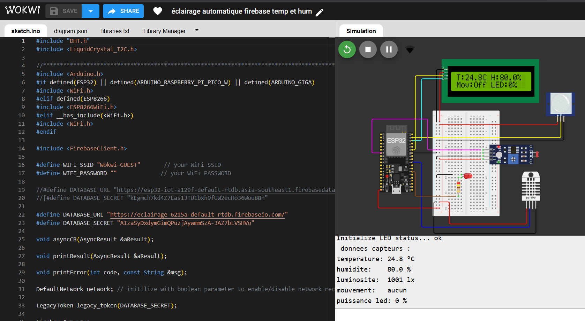
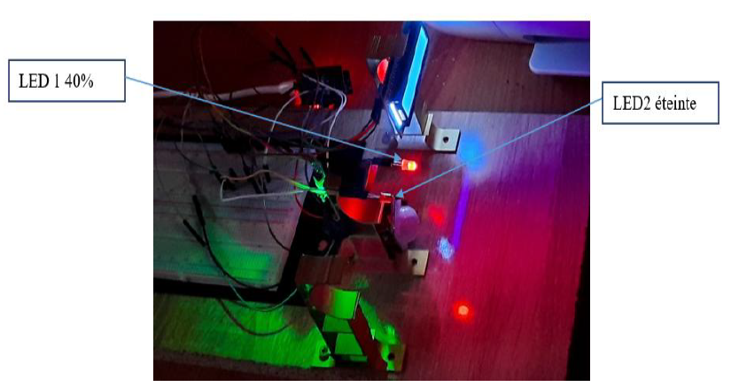
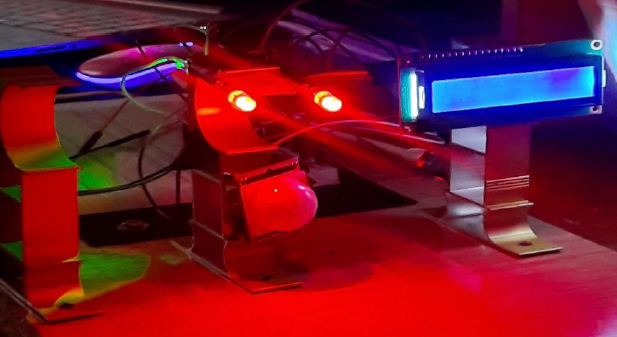
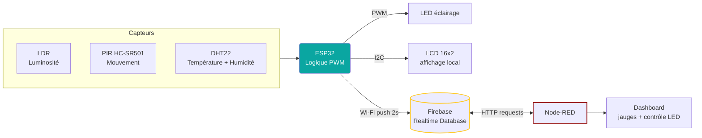
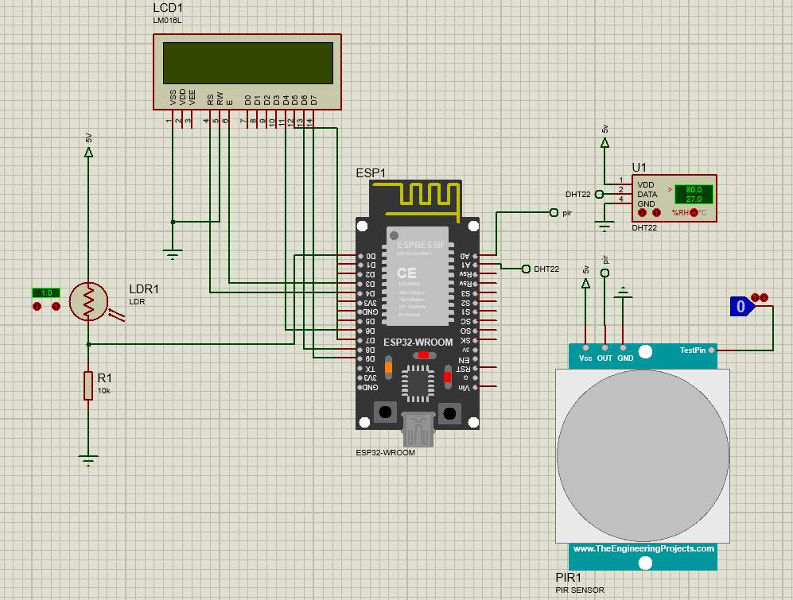
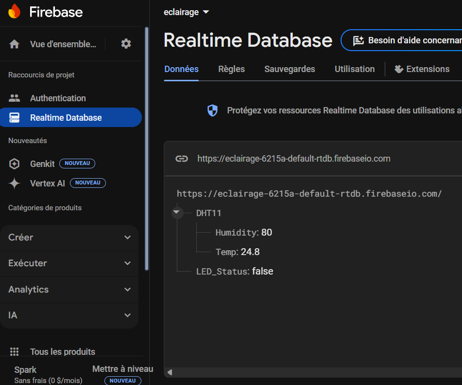
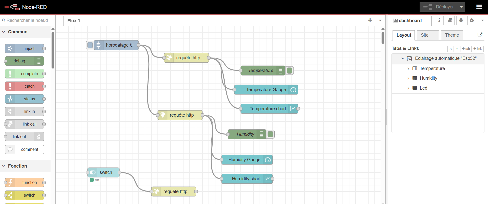
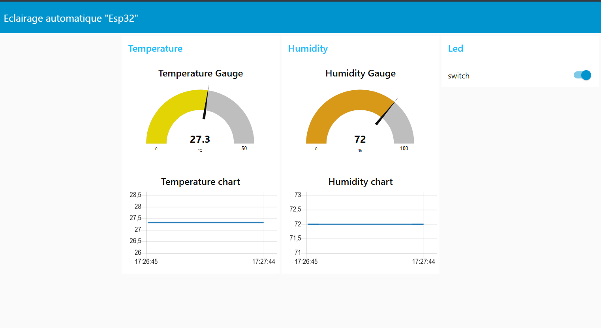

<div align="center">

# Éclairage Public Intelligent — ESP32

### Éclairage public adaptatif — fusion de capteurs, commande PWM, télémétrie Firebase et supervision Node-RED


`IoT` · `Fusion de capteurs` · `PWM` · `Télémétrie Cloud` · `Dashboard Temps Réel`

</div>

---

## 📋 Vue d'ensemble

Nœud IoT autonome basé sur ESP32 pour l'éclairage public adaptatif. Contrairement à un lampadaire classique qui fonctionne à puissance fixe, ce système ajuste la luminosité de la LED en temps réel selon trois critères combinés :

- **Lumière ambiante** (LDR) — pas d'éclairage inutile en plein jour
- **Présence humaine** (PIR) — puissance renforcée uniquement quand quelqu'un est présent
- **Conditions météo** (DHT22) — priorité à la sécurité en cas de brouillard ou de brume

La décision d'éclairage est **entièrement locale** : la boucle de commande PWM tourne directement sur l'ESP32, sans dépendance réseau. Le cloud (Firebase) et le dashboard (Node-RED) n'interviennent qu'en complément, pour la supervision et le contrôle à distance — jamais dans le chemin critique de décision.

| | |
|---|---|
| **Capteurs** | LDR · PIR HC-SR501 · DHT22 (température + humidité) |
| **Actionneur** | LED PWM 8 bits — 5 niveaux de luminosité |
| **Affichage local** | LCD I²C 16×2 — lecture des capteurs en direct |
| **Cloud** | Firebase Realtime Database — télémétrie toutes les 2s |
| **Supervision** | Dashboard Node-RED + contrôle LED à distance |

## 🎥 Démonstration

### Simulation Wokwi

<div align="center">
  
  <br><em>Conditions crépusculaires (LDR faible), aucun mouvement → LED à 60%</em>
</div>

### Comportement physique — nuit, sans puis avec détection de mouvement

<div align="center">
  
  <br><em>Figure 33 — Nuit sans détection de mouvement : LED1 à 40% (veille), LED2 éteinte</em>
</div>

<br>

<div align="center">
  
  <br><em>Figure 34 — Nuit avec détection de mouvement : luminosité portée à 100%</em>
</div>

## 🎬 Vidéo de démonstration

- [Démo du système en fonctionnement](https://www.youtube.com/watch?v=EHpKnXJo-uQ)
- [Simulation Wokwi + supervision Firebase / Node-RED](https://www.youtube.com/watch?v=fqYFnJnT2C4)

## 🧠 Logique d'éclairage

La décision s'exécute toutes les 500 ms, en deux étages.

### Étage 1 — Prépondérance météo

Le brouillard ou la brume forcent la lampe à une luminosité élevée fixe, indépendamment de la lumière ambiante ou du mouvement détecté. La sécurité routière prime sur l'économie d'énergie.

| Condition | Alerte | LED |
|---|---|---|
| T < 0 °C et HR > 95 % | Brouillard | 100 % |
| T < 2 °C et HR > 90 % | Brume | 80 % |

### Étage 2 — Luminosité adaptative

En l'absence d'alerte météo, la lecture du LDR est mappée sur quatre régimes. Une détection PIR élève la puissance au niveau "avec mouvement" et démarre un **maintien de 30 secondes** — la lampe conserve ce niveau pendant 30s après la dernière détection avant de redescendre en veille. Sans ce maintien, la lampe scintillerait à chaque passage, le PIR relâchant brièvement son signal.

| Luminosité ambiante (LDR) | Régime | Avec mouvement | Veille |
|---|---|---|---|
| ≥ 800 | Jour | 0 % | 0 % |
| 500 – 799 | Aube / Crépuscule | 60 % | 40 % |
| 200 – 499 | Crépuscule avancé | 80 % | 60 % |
| < 200 | Nuit profonde | 100 % | 80 % |

## 🏗️ Architecture



### Schéma de câblage (Proteus)

<div align="center">
  
  <br><em>Câblage complet : ESP32, LDR, PIR, DHT22, LCD I2C</em>
</div>

### Firebase Realtime Database

<div align="center">
  
  <br><em>Température et humidité poussées toutes les 2 secondes par l'ESP32</em>
</div>

### Flux Node-RED

<div align="center">
  
  <br><em>Requêtes HTTP temporisées récupérant T° et humidité depuis Firebase ; un switch permet le contrôle à distance de /LED_Status</em>
</div>

### Dashboard Node-RED

<div align="center">
  
  <br><em>Température et humidité en direct, historique graphique, et contrôle LED à distance</em>
</div>

## 🔧 Matériel

| Composant | Référence | Broche ESP32 |
|---|---|---|
| Microcontrôleur | ESP32 DevKit v1 | — |
| Capteur T° + Humidité | DHT22 | GPIO 5 |
| Capteur de luminosité | LDR + diviseur 10 kΩ | GPIO 32 |
| Capteur de mouvement | PIR HC-SR501 | GPIO 23 |
| Sortie LED | LED haute luminosité | GPIO 4 |
| Afficheur local | LCD 16×2 + PCF8574 I²C (0x27) | SDA / SCL |

## 💻 Code — Prépondérance météo puis logique adaptative

```cpp
if (temperature < 0 && humidite > 95) {
    puissanceLED = 255;
    alerteActive = true;
    messageAlerte = "Alerte Brouillard";
}
else if (temperature < 2 && humidite > 90) {
    puissanceLED = 204;
    alerteActive = true;
    messageAlerte = "Alerte Brume";
}
else {
    if (valeurLDR >= 800) {
        puissanceLED = 0; // Jour
    }
    else if (valeurLDR >= 500 && valeurLDR < 800) {
        if (mouvementDetecte) {
            puissanceLED = 153; // 60% — aube/crépuscule avec mouvement
            maintienActif = true;
            debutMaintien = millis();
        }
        else if (maintienActif && (millis() - debutMaintien < dureeMaintien)) {
            puissanceLED = 153; // Maintien 30s
        }
        else {
            puissanceLED = 102; // Veille 40%
            maintienActif = false;
        }
    }
    // ... régimes crépuscule et nuit profonde suivent la même logique
}
analogWrite(brocheLED, puissanceLED);
```

## 💻 Code — Envoi de la télémétrie vers Firebase

```cpp
Database.set<float>(aClient, "/DHT11/Temp", temperature);
Database.set<float>(aClient, "/DHT11/Humidity", humidite);
Database.set<bool>(aClient, "/LED_Status", false);
```

## 🚀 Démarrage

### Prérequis

- Arduino IDE 2.x + support carte ESP32 (Espressif)
- Librairies : `FirebaseClient` (mobizt) · `DHT sensor library` (Adafruit) · `LiquidCrystal_I2C`

### Identifiants

⚠️ Ne jamais committer tes vraies valeurs. Utilise un fichier séparé, ignoré par Git :

```cpp
#define WIFI_SSID "ton_ssid"
#define WIFI_PASSWORD "ton_mot_de_passe"
#define DATABASE_URL "https://ton-projet-default-rtdb.firebaseio.com/"
#define DATABASE_SECRET "ton_secret_firebase"
```

### Flash

Ouvrir le `.ino` dans Arduino IDE → sélectionner `ESP32 Dev Module` → Upload. Moniteur série à 115200 bauds.

### Simulation Wokwi

Le même firmware tourne dans Wokwi sans matériel physique. Régler `WIFI_SSID = "Wokwi-GUEST"` et `WIFI_PASSWORD = ""`.

## 🔭 Pistes d'amélioration

- **Externaliser les identifiants** (Wi-Fi, secret Firebase) dans un fichier `config.h` non versionné (`.gitignore`)
- **Passer à un token Firebase moderne** plutôt qu'un `LegacyToken`, pour une meilleure sécurité
- **Ajouter un capteur de trafic ou de comptage** pour affiner davantage la décision d'éclairage selon la fréquentation réelle
- **Historisation locale** en cas de coupure Wi-Fi, pour ne pas perdre les mesures entre deux reconnexions
- **Alertes proactives** (Telegram ou email) en cas de panne capteur détectée sur la durée

## 🛠 Tech Stack

`ESP32` · `C++ (Arduino)` · `Firebase Realtime Database` · `Node-RED` · `PWM` · `DHT22` · `LDR` · `PIR` · `Wokwi` · `IoT`

